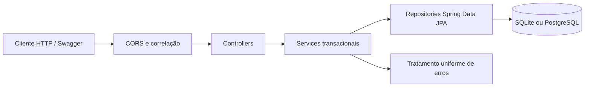

# API de Estoque e Ferramentas

Aplicação web para controlar usuários internos, itens consumíveis, ferramentas
patrimoniais e seus históricos de movimentação. O backend Spring Boot inicia
localmente com SQLite e oferece PostgreSQL para produção; o frontend usa React,
TypeScript e Vite.

> Esta versão implementa autenticação JWT, sessão persistente por refresh cookie
> e autorização por membership ativa na organização.

## Funcionalidades

- CRUD com inativação lógica de usuários, itens e ferramentas.
- Entrada, saída e correção auditável do saldo de itens.
- Retirada, devolução, transferência, manutenção, perda e correção de ferramentas.
- Responsável, horário de retirada e destino operacional atual da ferramenta.
- Revisão administrativa posterior e resumo incremental de movimentações.
- Consulta de ferramentas emprestadas, último responsável e itens abaixo do mínimo.
- Históricos operacionais imutáveis para auditoria; apenas a confirmação administrativa é atualizável.
- Validação de entrada, tratamento uniforme de erros e correlação de logs.
- Swagger UI, OpenAPI 3.1 e healthcheck operacional.
- Perfis separados para SQLite e PostgreSQL.
- Schema versionado por Flyway e validado pelo Hibernate.
- JWT curto em memória, refresh cookie HttpOnly rotativo, revogação de sessões e proteção contra força bruta.
- Interface React responsiva para os fluxos operacionais do MVP.

## Arquitetura

O projeto preserva a arquitetura em camadas original:



- `controller`: contrato HTTP, status e validação dos parâmetros de rota.
- `dto`: entradas e respostas da API; entidades JPA nunca são serializadas diretamente.
- `service`: regras de negócio, transações, logging e conversão para DTO.
- `repository`: persistência e planos de carga com `@EntityGraph`.
- `entity`: mapeamento JPA, constraints, índices e controle otimista de concorrência.
- `config`: CORS, OpenAPI e correlação das requisições.
- `exception`: formato e tradução uniforme de erros.

## Tecnologias

| Tecnologia | Versão/linha |
|---|---|
| Java | 17 LTS |
| Spring Boot | 3.5.16 |
| Spring Web / Validation / Data JPA / Actuator | gerenciadas pelo Spring Boot |
| Hibernate ORM | 6.6.x |
| Springdoc OpenAPI | 2.8.17 |
| PostgreSQL JDBC | gerenciado pelo Spring Boot |
| SQLite JDBC | 3.53.1.0 |
| Flyway | 11.7.2, gerenciado pelo Spring Boot |
| JaCoCo | 0.8.12 |
| Maven | 3.9 ou superior |
| React / TypeScript / Vite | 19 / 7.0 / 8.2 |
| Node.js / npm | 24 / 11 |

## Requisitos

Para execução local:

- JDK 17;
- Maven 3.9+;
- Node.js 24 e npm 11 para desenvolver ou gerar o frontend;
- porta 8080 livre, ou `SERVER_PORT` com outra porta.

Para execução em contêineres:

- Docker Engine com Docker Compose v2.

Confira as instalações:

```bash
java -version
mvn -version
docker compose version
```

## Instalação e execução rápida com SQLite

O perfil padrão é `sqlite`; não é necessário instalar servidor de banco. Em um
clone novo, no qual `estoque.db` ainda não existe, Flyway cria integralmente o
schema e o Hibernate o valida:

```bash
mvn clean spring-boot:run
```

Na primeira inicialização, o arquivo `estoque.db` é criado sem dados fictícios.
Para carregar opcionalmente os nove registros de demonstração, ative os profiles
`sqlite,sqlite-seed`; o callback é idempotente e executa depois das migrações.

```powershell
$env:SPRING_PROFILES_ACTIVE='sqlite,sqlite-seed'
mvn spring-boot:run
```

Se o arquivo já existia antes da adoção do Flyway, a inicialização padrão falha
por segurança. Faça backup e siga a baseline verificada descrita em
[FLYWAY_MIGRATIONS.md](FLYWAY_MIGRATIONS.md); não habilite baseline às cegas.

Endereços:

- API: `http://localhost:8080/api/usuarios`
- Swagger UI: `http://localhost:8080/swagger-ui.html`
- OpenAPI JSON: `http://localhost:8080/v3/api-docs`
- Healthcheck: `http://localhost:8080/actuator/health`

Para usar outro arquivo SQLite:

Windows PowerShell:

```powershell
$env:SQLITE_URL='jdbc:sqlite:C:/dados/estoque.db'
mvn spring-boot:run
```

Linux/macOS:

```bash
export SQLITE_URL='jdbc:sqlite:/dados/estoque.db'
mvn spring-boot:run
```

## PostgreSQL local

Crie um banco e forneça as credenciais por variáveis de ambiente. `DB_PASSWORD` é obrigatória e não possui valor padrão.

Windows PowerShell:

```powershell
$env:SPRING_PROFILES_ACTIVE='postgresql'
$env:DB_URL='jdbc:postgresql://localhost:5432/estoque_db'
$env:DB_USERNAME='estoque'
$env:DB_PASSWORD='sua-senha-local'
mvn spring-boot:run
```

Linux/macOS:

```bash
export SPRING_PROFILES_ACTIVE=postgresql
export DB_URL='jdbc:postgresql://localhost:5432/estoque_db'
export DB_USERNAME='estoque'
export DB_PASSWORD='sua-senha-local'
mvn spring-boot:run
```

Flyway aplica as migrações PostgreSQL próprias e o Hibernate usa `validate`.
Um PostgreSQL existente exige comparação real com V1 antes de qualquer baseline;
a baseline automática fica desabilitada.

## Docker com PostgreSQL

O Compose cria backend, PostgreSQL 17, volume persistente, rede privada e healthchecks dos dois serviços.

1. Crie o arquivo local de ambiente:

   Windows:

   ```powershell
   Copy-Item .env.example .env
   ```

   Linux/macOS:

   ```bash
   cp .env.example .env
   ```

2. Abra `.env` e substitua obrigatoriamente `POSTGRES_PASSWORD`.

3. Construa e inicie:

   ```bash
   docker compose up --build -d
   ```

4. Verifique:

   ```bash
   docker compose ps
   docker compose logs -f backend
   ```

5. Encerre sem apagar os dados:

   ```bash
   docker compose down
   ```

O banco fica no volume `estoque_postgres_data`. `docker compose down -v` também apaga esse volume e deve ser usado somente quando a perda dos dados for intencional.

## Variáveis de ambiente

| Variável | Padrão | Finalidade |
|---|---|---|
| `SPRING_PROFILES_ACTIVE` | perfil padrão `sqlite` | ativa `sqlite` ou `postgresql` |
| `SERVER_PORT` | `8080` | porta HTTP |
| `SQLITE_URL` | `jdbc:sqlite:estoque.db` | arquivo SQLite |
| `DB_URL` | `jdbc:postgresql://localhost:5432/estoque_db` | conexão PostgreSQL |
| `DB_USERNAME` | `estoque` | usuário PostgreSQL |
| `DB_PASSWORD` | sem padrão | senha PostgreSQL obrigatória |
| `APP_JWT_SECRET` | sem padrão | chave Base64 aleatória de, no mínimo, 32 bytes |
| `APP_ACCESS_TOKEN_TTL` | `15m` | duração do JWT de acesso |
| `APP_REFRESH_TOKEN_TTL` | `30d` | duração máxima do refresh token |
| `APP_REFRESH_COOKIE_SECURE` | `false` (`true` em `prod`) | envia o refresh cookie somente por HTTPS |
| `APP_REFRESH_COOKIE_SAME_SITE` | `Lax` | política `Strict`, `Lax` ou `None` do cookie |
| `APP_PASSWORD_RESET_TOKEN_TTL` | `30m` | validade da recuperação interna |
| `APP_MAX_FAILED_LOGIN_ATTEMPTS` | `5` | falhas consecutivas antes do bloqueio |
| `APP_LOGIN_LOCK_DURATION` | `15m` | duração do bloqueio temporário |
| `FLYWAY_BASELINE_ON_MIGRATE` | `false` | opt-in exclusivo para incorporar SQLite legado já verificado |
| `CORS_ALLOWED_ORIGINS` | `http://localhost:3000,http://localhost:5173` | origens web permitidas, separadas por vírgula |
| `CORS_ALLOWED_METHODS` | `GET,POST,PUT,DELETE,OPTIONS` | métodos CORS |
| `CORS_ALLOWED_HEADERS` | `Content-Type,Accept,Authorization,X-Correlation-Id,X-Organization-Id` | cabeçalhos CORS |
| `CORS_ALLOW_CREDENTIALS` | `true` | envio do refresh cookie pelo navegador |
| `CORS_MAX_AGE` | `3600` | cache do preflight em segundos |
| `LOG_LEVEL_ROOT` | `INFO` | nível global de logs |
| `LOG_LEVEL_APP` | `INFO` | nível do código da aplicação |
| `SPRINGDOC_API_DOCS_ENABLED` | `true` | habilita `/v3/api-docs` |
| `SPRINGDOC_SWAGGER_UI_ENABLED` | `true` | habilita Swagger UI |

Nunca versione `.env`, bancos locais ou arquivos de log. O `.gitignore` já cobre esses arquivos.

## Scripts

### Windows

Como algumas máquinas bloqueiam scripts por política local, use execução pontual sem alterar a política permanente:

```powershell
powershell -NoProfile -ExecutionPolicy Bypass -File .\scripts\windows\run.ps1
powershell -NoProfile -ExecutionPolicy Bypass -File .\scripts\windows\test.ps1
powershell -NoProfile -ExecutionPolicy Bypass -File .\scripts\windows\clean.ps1
powershell -NoProfile -ExecutionPolicy Bypass -File .\scripts\windows\build.ps1
powershell -NoProfile -ExecutionPolicy Bypass -File .\scripts\windows\coverage.ps1
```

### Linux e macOS

```bash
chmod +x scripts/linux-macos/*.sh
./scripts/linux-macos/run.sh
./scripts/linux-macos/test.sh
./scripts/linux-macos/clean.sh
./scripts/linux-macos/build.sh
./scripts/linux-macos/coverage.sh
```

| Script | Ação |
|---|---|
| `run` | inicia pelo plugin Spring Boot |
| `test` | executa a suíte |
| `clean` | remove artefatos Maven em `target` |
| `build` | empacota sem repetir testes |
| `coverage` | executa `clean verify` e gera JaCoCo |

## Testes e cobertura

```bash
mvn clean verify
```

A suíte backend contém atualmente 112 testes; a suíte frontend possui
172 testes. Elas atravessam HTTP, validação, services, repositories, segurança,
SQLite e PostgreSQL 17 via Testcontainers, além de
exercitar migrações Flyway, assinatura integral do baseline, sessões rotativas,
revogação, força bruta, isolamento entre organizações, fluxo operacional de
ferramentas e disputas concorrentes de retirada nos dois bancos.

Relatórios gerados:

- HTML: `target/site/jacoco/index.html`
- XML: `target/site/jacoco/jacoco.xml`
- CSV: `target/site/jacoco/jacoco.csv`
- resultados: `target/surefire-reports/`

Os números da última execução estão em [COVERAGE_REPORT.md](COVERAGE_REPORT.md).

### Smoke test SQLite isolado

Depois de gerar o JAR com `mvn clean verify`, execute:

```powershell
powershell -NoProfile -ExecutionPolicy Bypass -File .\scripts\smoke-test.ps1
```

O script usa `SQLITE_URL` para criar um banco exclusivo em `target/smoke-test/<UUID>/smoke.db`. Ele aplica Flyway, inicia o JAR duas vezes sobre o mesmo arquivo, valida healthcheck, OpenAPI, Swagger, requisições válida/inválida e ausência de duplicidades. O banco temporário é removido no final, e o teste falha se tamanho, timestamp ou SHA-256 de `estoque.db` mudarem.

Use `-KeepArtifacts` somente para diagnóstico local; o comportamento padrão é remover o banco isolado.

### Integração contínua

A pipeline `.github/workflows/ci.yml` usa Java 17 e cache Maven. Em pushes e
pull requests ela executa `mvn clean verify`, exige no mínimo os 112 testes do
baseline atual e confirma a execução das treze classes de teste esperadas. O
workflow rejeita falhas, erros, testes ignorados ou relatórios Surefire
ausentes, mas permite que novos testes aumentem o total sem exigir manutenção
da contagem. JaCoCo, PMD, CPD e o smoke test SQLite isolado continuam
obrigatórios. Um job separado usa Node.js 24, `npm ci`, exige no mínimo 172
testes React e gera o build de produção. Não há publicação, deploy ou secrets
de produção.

## Contrato HTTP e erros

Status principais:

- `200`: consulta/alteração concluída;
- `201`: recurso ou movimentação criada;
- `204`: inativação concluída;
- `400`: validação ou regra de negócio;
- `404`: recurso/rota inexistente;
- `405`: método HTTP não aceito;
- `409`: integridade ou atualização concorrente;
- `500`: falha inesperada, sem detalhe interno.

Exemplo sanitizado:

```json
{
  "timestamp": "2026-08-04T10:15:30",
  "status": 400,
  "codigo": "DADOS_INVALIDOS",
  "erro": "Dados inválidos",
  "mensagem": "Um ou mais campos estão inválidos. Veja o detalhe em 'campos'.",
  "caminho": "/api/usuarios",
  "referencia": "a7662424-1c18-41e5-9c77-fb691a56af12",
  "campos": {
    "email": "E-mail é obrigatório"
  }
}
```

O cabeçalho `X-Correlation-Id` é devolvido na resposta e aparece nos logs. Valores recebidos nesse cabeçalho são aceitos somente no formato seguro de até 64 caracteres.

## Banco e integridade

- E-mail, código do item e patrimônio possuem unicidade materializada pelas migrações e validação na aplicação.
- FKs de movimentações são obrigatórias.
- Quantidades e campos essenciais usam `NOT NULL` e checks de não negatividade.
- O estado `EMPRESTADA` exige responsável atual; outros estados exigem responsável e contexto operacional nulos.
- Entidades mutáveis usam `@Version`; retiradas usam também lock transacional para impedir dupla posse.
- Índices cobrem status, ativos, responsáveis, revisão administrativa e históricos por recurso/data.
- Campos operacionais do histórico são não atualizáveis e não possuem endpoints de alteração/exclusão;
  somente status, ADMIN e horário da confirmação posterior podem ser gravados.

## Estrutura de pastas

```text
.
├── src/main/java/com/equipe/estoque
│   ├── config
│   ├── controller
│   ├── dto
│   ├── entity
│   ├── enums
│   ├── exception
│   ├── repository
│   └── service
├── src/main/resources
│   ├── application.properties
│   ├── application-sqlite.properties
│   ├── application-sqlite-seed.properties
│   ├── application-postgresql.properties
│   ├── db/migration/sqlite
│   ├── db/migration/postgresql
│   └── db/seed/sqlite
├── src/test
├── frontend
│   ├── src
│   ├── public
│   └── docs
├── scripts/windows
├── scripts/linux-macos
├── Dockerfile
├── docker-compose.yml
└── pom.xml
```

## Screenshots

Não há screenshots versionados no repositório. A interface React cobre os fluxos
do MVP, mas imagens estáveis ainda precisam ser selecionadas e adicionadas.

## Segurança e limites atuais

- Credenciais foram retiradas do código e dos arquivos versionáveis.
- CORS é restritivo e configurável.
- Stacktraces, causas e mensagens técnicas não são devolvidos ao cliente.
- Logs não registram payload, e-mail, senha ou stacktrace; usam IDs e referência.
- Access JWT curto permanece em memória; o refresh token rotativo usa cookie
  HttpOnly e somente seu hash é persistido.
- Troca de senha e logout global revogam sessões anteriores.
- Swagger fica desabilitado no profile de produção.

Consulte [SECURITY.md](SECURITY.md) para política de força bruta, geração e
rotação de `APP_JWT_SECRET` e o limite atual da recuperação de senha.

## Roadmap

1. Integrar um provedor confiável para entrega de tokens de recuperação de senha.
2. Paginar listagens e históricos potencialmente grandes.
3. Tornar os dados de auditoria independentes de alterações cadastrais posteriores.
4. Adicionar screenshots estáveis dos fluxos de usuário.
5. Adicionar métricas, tracing e alertas; avaliar cache somente após medir a carga.

## PRODUCTION DEPLOYMENT REQUIREMENTS

- Java 17 para executar o backend e Node.js 24 para gerar o build estático do frontend;
- PostgreSQL disponível e protegido; SQLite é restrito ao desenvolvimento e aos testes;
- HTTPS obrigatório, normalmente terminado por um reverse proxy;
- secrets externos para `APP_JWT_SECRET`, usuário e senha do banco;
- origem pública do frontend na allowlist CORS, com credenciais habilitadas;
- refresh cookie com `Secure=true`, `HttpOnly`, `Path=/api/auth` e `SameSite` adequado à topologia;
- Flyway V1–V8 aplicado no startup e Hibernate com `ddl-auto=validate`;
- healthcheck em `/actuator/health`, usado pelo orquestrador sem expor detalhes internos;
- backups periódicos e restauração do PostgreSQL testada;
- coleta de logs, monitoramento de disponibilidade e alertas operacionais.

O profile `prod` falha no startup se o cookie não for seguro, se CORS não aceitar
credenciais ou se uma origem local for configurada. O provedor de hospedagem,
DNS, certificados, reverse proxy e serviço gerenciado de PostgreSQL ainda devem
ser escolhidos antes do deploy real.

## Relatórios e roteiro

- [HARDENING_REPORT.md](HARDENING_REPORT.md)
- [FLYWAY_MIGRATIONS.md](FLYWAY_MIGRATIONS.md)
- [CODE_REVIEW_REPORT.md](CODE_REVIEW_REPORT.md)
- [COVERAGE_REPORT.md](COVERAGE_REPORT.md)
- [ROTEIRO_TESTES_MANUAIS.md](ROTEIRO_TESTES_MANUAIS.md)
- [CHANGELOG.md](CHANGELOG.md)

## Licença

O arquivo [LICENSE](LICENSE) reserva todos os direitos. Nenhuma licença permissiva foi presumida sem decisão explícita do titular do projeto.
